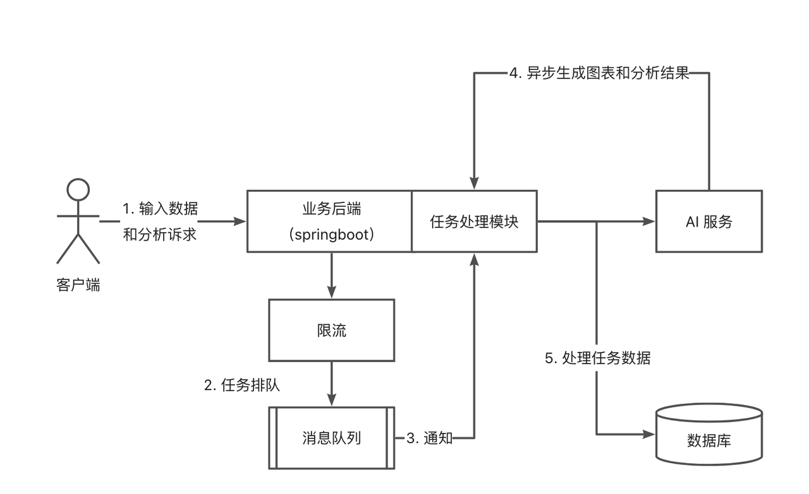
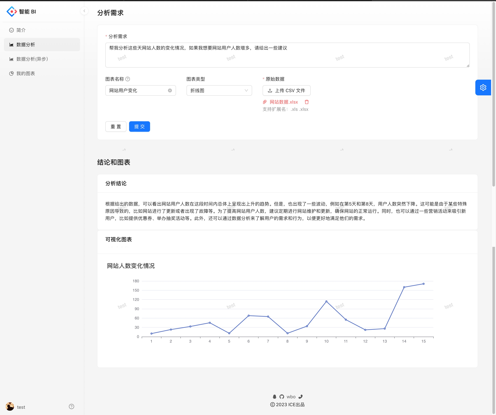
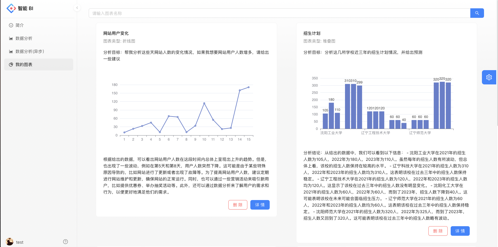

# 项目简介

## 项目介绍

基于React+Spring Boot +RabbitMQ + AIGC 的智能数据分析平台

区别于传统的BI，用户只需要提供原始数据、并输入分析需求，就能自动生成可视化图表以及分析结论，实现对数据的分析。

## 项目架构图

## 技术选型

### 前端

- React18
- Ant Design Pro5.x脚手架
- Umi4前端框架
- Ant Design组件库
- Echarts可视化库
- OpenAPI前端代码生成

### 后端

- Java Spring Boot(万用后端模板)
- MySQL数据库
- MyBatis-Plus及MyBatis X自动生成
- Redis+Redisson限流
- RabbitMQ消息队列
- 讯飞星火大模型（AI能力）
- JDK线程池及异步化
- Easy Excel表格数据处理
- Swagger+Knife4j接口文档生成
- Hutool、Apache Common Utils等工具库

分析页面

图表页面

